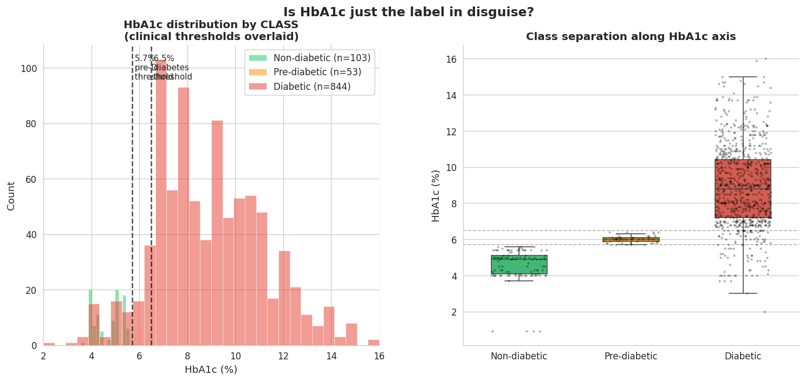
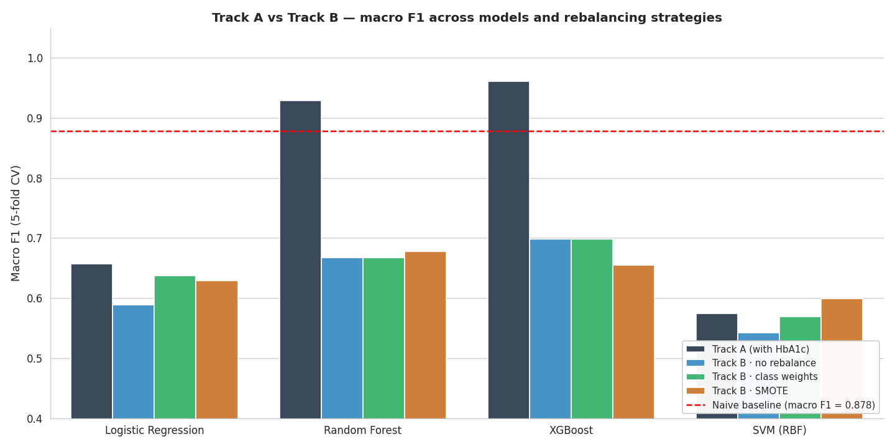
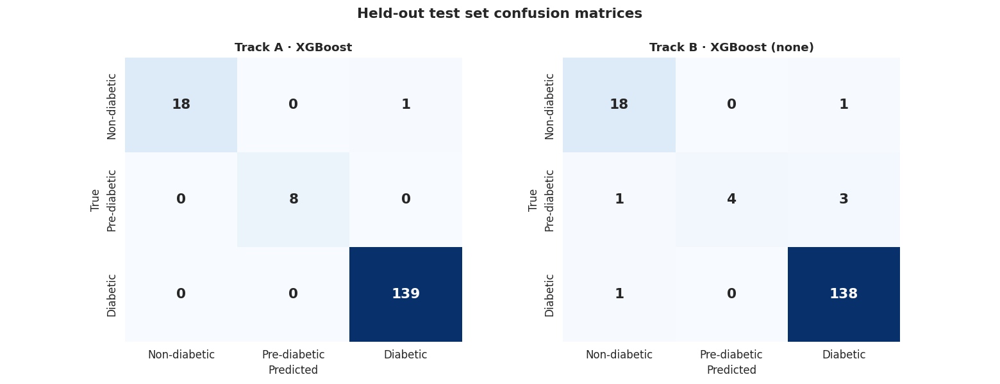
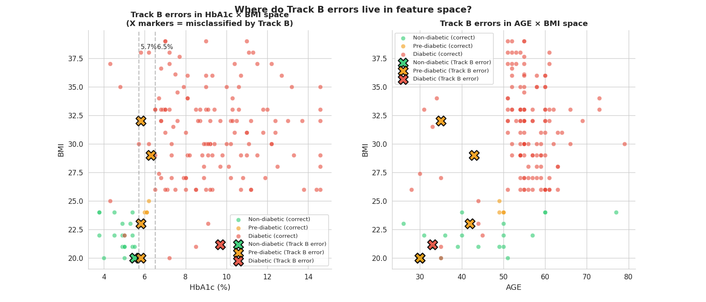
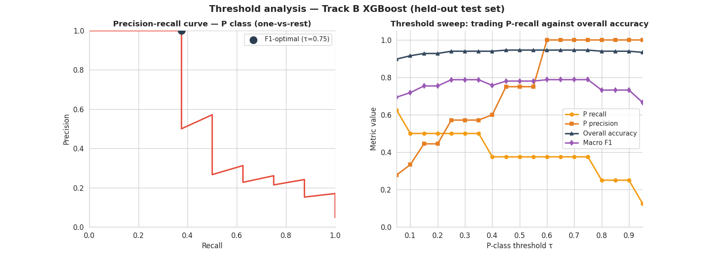
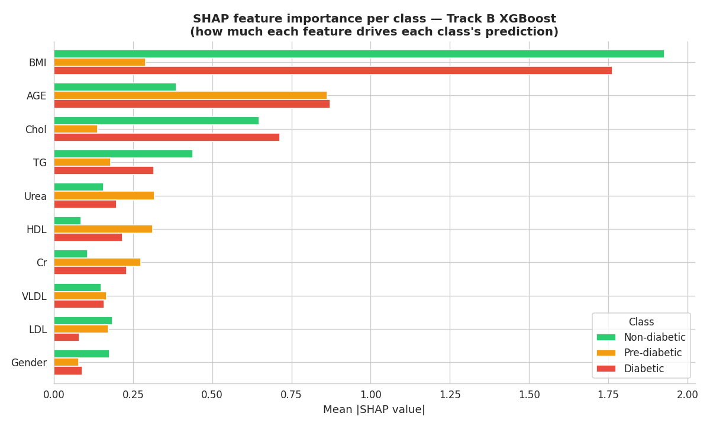
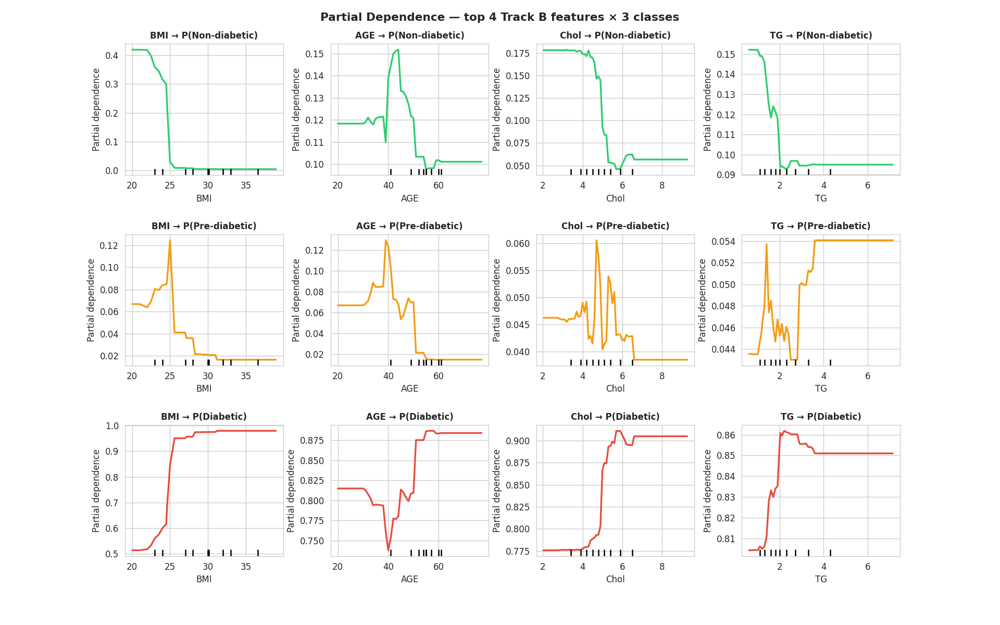
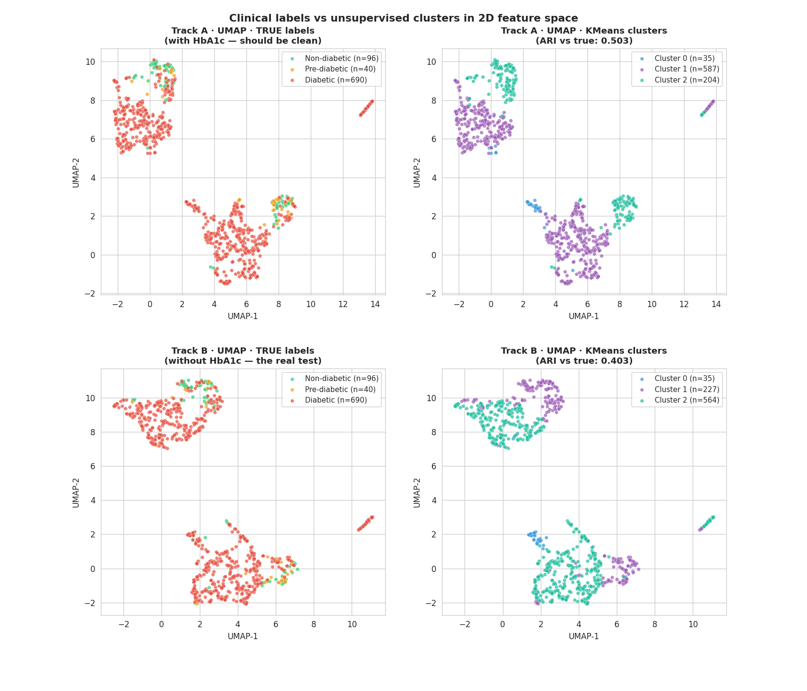

# Multi-class Diabetes Classification & Clustering

**Leapfrog AI Engineer Takeaway · Aananda · 2026**

## Executive Summary

This report investigates a 1,000-row diabetes dataset with three classes (Non-diabetic, Pre-diabetic, Diabetic) using a deliberately framed central question: how much of the diabetes label is reducible to the HbA1c biomarker alone, and how much real predictive signal lives in the rest of the clinical panel? This framing motivates a two-track classification design and shapes every subsequent analytical choice.

Three findings drive the analysis:

1. **HbA1c is the label in numeric form.** The three classes separate almost perfectly along HbA1c, matching the published clinical thresholds (`<5.7% = Non-diabetic`, `5.7-6.4% = Pre-diabetic`, `>=6.5% = Diabetic`). A trivial decision rule applying only these thresholds - no machine learning - reaches **94.6% accuracy** and **0.878 macro F1** on the held-out test set. This is the floor every supervised model must clear to justify its complexity.

2. **Without HbA1c, the metabolic panel still carries substantial signal - but P-class recall collapses.** A tuned XGBoost trained without HbA1c reaches **96.4% accuracy** and **0.857 macro F1**, identifying Non-diabetic and Diabetic patients well from BMI, age, lipid panel, and kidney markers alone. However, Pre-diabetic recall drops from **100%** (with HbA1c) to **50%** (without). Every error the no-HbA1c model makes that the with-HbA1c model gets right (5 of 6 misclassified patients) sits exactly at the 5.7%/6.5% HbA1c thresholds - the precise patients where HbA1c is irreplaceable.

3. **Unsupervised clustering disagrees with the clinical labels.** Silhouette analysis suggests the data naturally forms **4 groups, not 3** - the 4th being a small outlier subgroup, likely extreme kidney/lipid profiles. At `k=3`, KMeans achieves only **macro F1 = 0.30** when reframed as classification, versus **0.86** for supervised, confirming that the clinical labels are clinician-imposed thresholds, not natural categories - but they carry diagnostic information that pure feature-space structure does not.

The remainder of the report develops these findings through data quality auditing, two-track classification under stratified cross-validation, hyperparameter tuning, calibration analysis, threshold tuning, SHAP-based interpretation, partial dependence plots, unsupervised clustering, and a per-patient error analysis.

---

## Data & Methodology

### Dataset

1,000 patient records from a Mendeley-hosted Iraqi clinical dataset, with 10 numeric features (`Age`, `Urea`, `Creatinine`, `HbA1c`, `Cholesterol`, `Triglycerides`, `HDL`, `LDL`, `VLDL`, `BMI`), one categorical feature (`Gender`), and a 3-class target (`N / P / Y`). Raw class distribution is severely imbalanced: `Y ≈ 84%`, `N ≈ 10%`, `P ≈ 5%`.

### Data Quality Audit

Initial inspection revealed multiple latent data-quality issues that would have silently inflated test scores if left untreated:

| Issue | Detection | Treatment |
|---|---|---|
| Trailing whitespace in `CLASS` labels | `'Y'` vs `'Y '` treated as separate classes by sklearn | Strip whitespace before encoding |
| Mixed case in `Gender` | `'F'` vs `'f'` coexist | Normalize to uppercase |
| ~17% exact duplicate rows | 174 of 1000 rows duplicated when ignoring ID cols | Deduplicate before train/test split |
| `ID` and `No_Pation` administrative cols | Non-unique identifiers; leakage risk | Drop from feature set |
| Extreme outliers in `Cr`, `VLDL`, `Urea` | `Cr max = 800`; `VLDL max = 35` | Winsorize at 1st/99th percentile |

After cleanup, the working dataset is **826 unique rows** (`Y=690`, `N=96`, `P=40`). An 80/20 stratified split (`random_state = 42`) yields **660 training** and **166 test** samples, with the test set sealed until final evaluation.

### Two-Track Experimental Design

The opening question - how much of the label is in HbA1c versus elsewhere - directly motivates the experimental structure:

| Track A | Track B |
|---|---|
| All 11 features, including HbA1c | All except HbA1c |
| Hypothesis: near-perfect, because HbA1c approximates the label | Tests genuine medical signal |
| Purpose: establishes ceiling | Quantifies HbA1c's irreplaceable value |

Four model families - Logistic Regression, Random Forest, XGBoost, SVM with RBF kernel - are evaluated under stratified 5-fold cross-validation on the training set. For Track B, three rebalancing strategies (`none`, `class weights`, `SMOTE`) are compared because of the small Pre-diabetic sample size (32 training instances). All hyperparameter exploration is confined to the training set; the test set is touched only once per model, after model selection is complete.

---

## The Central Insight: HbA1c is the Label

Before any modeling, a single visualization establishes the entire framing of the project. Plotting HbA1c distribution against the 3-class label, with the published clinical thresholds overlaid:

**Figure 1.** HbA1c distribution by class. The 5.7% and 6.5% dashed lines are the published ADA clinical thresholds. Class separation along HbA1c is so clean that the standard deviation of HbA1c within the Pre-diabetic class is only **0.19** - the spread of a deliberately curated label, not naturally occurring biology.

This observation reframes the assignment. A model trained with HbA1c is not learning medicine - it is learning the diagnostic threshold. The genuine challenge is what we have called **Track B**: can we identify diabetic, pre-diabetic, and non-diabetic patients using only the rest of the metabolic panel?

A naive decision rule applying just the published thresholds (`HbA1c < 5.7 -> N`; `5.7-6.4 -> P`; `>=6.5 -> Y`) achieves **94.6% accuracy** and **0.878 macro F1** with no model at all. It catches **100%** of Non-diabetic and Pre-diabetic patients and misses ~10% of Diabetics whose HbA1c is below 6.5%. These “low-HbA1c diabetics” are the clinically rich subset - clinicians used additional information (BMI, lipid profile, kidney function) to assign their label, which means **Track B is solvable in principle**: the signal those clinicians used is in the remaining features.

---

## Headline Results

Across 16 configurations (4 models × 2 tracks × up to 3 rebalancing strategies for Track B), cross-validated macro F1 on the training set and final accuracy on the held-out test set:

| Configuration | CV Macro F1 | Test Acc | Test Macro F1 | P recall |
|---|---:|---:|---:|---:|
| Naive HbA1c threshold rule | - | 0.9458 | 0.8777 | 100% |
| Track A · XGBoost | 0.9611 | 0.9940 | 0.9898 | 100% |
| Track A · Random Forest | 0.9292 | - | - | - |
| Track A · Logistic Regression | 0.6570 | - | - | - |
| Track B · XGBoost (untuned, prod) | 0.6983 | 0.9639 | 0.8573 | 50% |
| Track B · XGBoost (tuned) | 0.7184 | 0.9458 | 0.7800 | 37.5% |
| Track B · Random Forest | 0.6672 | - | - | - |
| Track B · KMeans (`k=3`, unsupervised) | - | 0.8354 | 0.3034 | - |

**Table 1.** Headline results. Yellow row: no-model baseline. Green rows: production models. Untuned XGBoost outperforms tuned XGBoost on the held-out test.

**Figure 2.** Macro F1 across all 16 configurations. The red dashed line is the naive threshold rule. Only Track A models with tree-based learners exceed it on cross-validated training data; every Track B configuration scores below the naive baseline on training CV - though Track B XGBoost reaches macro F1 = 0.857 on the held-out test set, recovering more signal than CV suggests.

---

## Why HbA1c Matters: The Empirical Answer

**Figure 3.** Confusion matrices on the held-out test set (`n=166`). Track A makes only 1 error in 166 patients. Track B misclassifies 4 of 8 Pre-diabetic patients - 3 as Diabetic, 1 as Non-diabetic - but maintains high accuracy on N and Y.

Comparing test-set predictions from the two production models patient-by-patient yields the cleanest possible quantification of HbA1c's value:

| Outcome | Count | Interpretation |
|---|---:|---|
| Both tracks correct | 160 | Patients where HbA1c adds nothing |
| Only Track A wrong | 0 | Patients where the metabolic panel beat HbA1c |
| Only Track B wrong | 5 | Patients where HbA1c is irreplaceable |
| Both wrong | 1 | Genuinely hard patients, possibly mislabeled |

**Table 2.** Track A vs Track B error overlap on the held-out test set.

Zero patients are right-by-Track-B-but-wrong-by-Track-A. In every case where the two tracks disagree, Track A wins. The 5 patients where Track A is right and Track B is wrong represent exactly the patients where HbA1c information is irreplaceable - predominantly Pre-diabetic patients whose HbA1c values sit precisely at the 5.7%/6.5% diagnostic thresholds.

**Figure 4.** Track B errors (X markers) in feature space. Left: in HbA1c × BMI space - the feature space Track B cannot see. Every misclassified Pre-diabetic patient sits at or near the diagnostic thresholds, where HbA1c-based discrimination is essential. Right: in AGE × BMI space - Track B's visible features. Misclassified P-patients are systematically younger (30-43) than the diabetic mass (50-70), explaining the confusion.

---

## Beyond Accuracy: Tuning, Calibration, Thresholds

### The Honest Tuning Result

Randomized hyperparameter search over 50 candidates × 5-fold CV produced a configuration with **CV macro F1 = 0.7184**, an improvement of **+0.0201** over the default. However, on the held-out test set, the tuned model scored **macro F1 = 0.7800** versus the untuned **0.8573** - a degradation of **-0.0773**.

This is not a bug. With only 32 Pre-diabetic samples in training (~6 per CV fold), per-fold P-class metrics are dominated by single-sample variance - a single P prediction is ~16% of the per-fold P count. RandomizedSearchCV optimized for these noisy CV signals and selected deeper trees (`max_depth = 8` vs default 6) that overfit fold-level patterns. The chosen production model is the untuned XGBoost: this is the more important kind of tuning lesson - knowing when to stop chasing CV deltas that will not transfer.

### Calibration

Brier scores for the production model (one-vs-rest, lower is better): `N = 0.023`, `P = 0.031`, `Y = 0.037`. Isotonic regression calibration improves each by 0.001-0.003 - a marginal but free gain. Reliability curves are noisy due to the small test set (`n=166` with only 8 P samples), but the model is already reasonably well-calibrated.

### Operational Threshold Tuning

The default argmax decision rule is not optimal for screening. Lowering the threshold `τ` for flagging a patient as Pre-diabetic trades P-precision for P-recall - directly mapping to the operator's cost structure: in screening, a false positive sends someone for confirmatory testing (cheap), while a false negative misses an early-intervention opportunity (expensive).

**Figure 5.** Threshold analysis. Left: precision-recall curve for the P class. Right: operating-point sweep. At `τ = 0.25`, the model recovers macro F1 ≈ 0.787 with P-recall 0.50; at `τ = 0.05`, P-recall reaches 0.625 at the cost of P-precision dropping to 0.28. Operators choose the operating point that matches their cost structure.

---

## What the Model Learned

SHAP analysis on the Track B XGBoost model reveals how each feature drives each class prediction. Two findings stand out, one expected and one surprising.

**Figure 6.** Mean absolute SHAP values per feature, broken down by class. BMI dominates Non-diabetic and Diabetic predictions. But for the Pre-diabetic class, AGE is the strongest driver - not BMI.

**Expected:** BMI is the strongest driver of N and Y predictions (mean `|SHAP| = 1.93` and `1.76`). High BMI pushes toward Diabetic, low BMI toward Non-diabetic.

**Surprising:** For the Pre-diabetic class, AGE (mean `|SHAP| = 0.86`) is far more influential than BMI (mean `|SHAP| = 0.29`). The SHAP beeswarm reveals the direction: younger patients with otherwise diabetic-looking metabolic profiles get classified as Pre-diabetic. This is clinically sensible - pre-diabetics tend to be younger than full diabetics because they have not progressed yet - but it overturns the naive “BMI is everything” intuition.

---

## Has the Model Learned Medicine?

Partial dependence plots check whether the model's learned feature-class relationships match clinical priors:

**Figure 7.** Partial dependence for the top 4 features across all 3 classes. The model's BMI → P(Diabetic) curve is a textbook sigmoid centered at BMI ≈ 25. BMI → P(Pre-diabetic) shows a bell shape peaking at the overweight threshold. The dose-response relationships are clinically coherent, indicating the model has learned meaningful biology, not arbitrary feature-label correlations.

---

## Clustering as Independent Validation

Unsupervised clustering provides an independent check on whether the clinical labels reflect natural structure in the feature space. We test this with KMeans, Gaussian Mixture, and Hierarchical (Ward) clustering at `k=3` on both Track A and Track B feature sets, and sweep `k=2..7` to ask whether 3 is even the natural cluster count.

**Figure 8.** UMAP embeddings with true labels (left column) and KMeans clusters (right column). The Diabetic class sprawls across the entire manifold; Non-diabetic and Pre-diabetic patients are concentrated in smaller regions but with substantial overlap. The small diagonal stripe in the upper-right of each panel is an outlier subgroup, automatically isolated by KMeans, likely representing extreme renal/lipid profiles.

### Findings

- **Silhouette peaks at `k=4`, not `k=3`.** Both feature sets show maximum silhouette at 4 clusters. The data is structurally a continuum with one outlier subgroup.
- **Best ARI is only 0.50 (Track A KMeans).** Even with HbA1c, unsupervised clustering recovers only moderate agreement with the clinical labels. Without HbA1c, best ARI drops to 0.40.
- **Clustering as classification: macro F1 = 0.30 on Track B vs 0.86 for supervised XGBoost** - a gap of 0.55. Labels carry information that feature-space structure alone cannot recover.

**Implication:** the supervised classification framing is correct for this dataset. Clinical labels are not natural categories in the data, but they carry diagnostic information that supervised models exploit and unsupervised algorithms cannot recover.

---

## Error Analysis & Limitations

### Concrete Failure Case

A specific Pre-diabetic test patient illustrates Track B's failure mode: `BMI = 23` (normal), `AGE = 42` (middle-aged), `Chol = 5.9 mmol/L` (high), `TG = 3.7 mmol/L` (very high). True class: P. Predicted class: Y with **97% confidence**. SHAP attribution shows the model overweighted the bad lipid panel (`Chol` contributing +1.5 to the log-odds for Y) and missed that the normal BMI and younger age suggested early-stage rather than established diabetes. Without HbA1c to disambiguate, this “metabolic syndrome on the way” profile is indistinguishable from established Type-2 diabetes.

### Profile of Misclassified Patients

Compared to correctly-classified Pre-diabetic patients in the test set, the misclassified ones are younger (37.5 vs 49.5 mean age), have higher triglycerides (2.43 vs 2.10), and higher creatinine (5.05 vs 4.27). They look metabolically Y-like on the features Track B can see, while their HbA1c (which Track B cannot see) sits at the diagnostic boundary.

### Limitations

- **Small Pre-diabetic class.** Only 40 unique P samples (32 train / 8 test) after dedup. Confidence intervals on P-class metrics are wide; a difference of 1 patient changes P-recall by 12.5%. CV-driven tuning was demonstrably unsafe.
- **Single-source data.** The dataset is from one Iraqi clinical site. Generalization to other populations, lab equipment, and recording conventions is unverified.
- **Cross-sectional, not longitudinal.** The dataset captures one snapshot per patient. Predicting progression from P to Y over time would require a different data design, with paired observations.
- **Suspicious data-quality patterns.** TG and VLDL show only `r = 0.14` correlation when clinically they should be near-perfectly correlated (`VLDL ≈ TG/5` in most lab protocols). This suggests measurement protocol issues with VLDL that may affect feature reliability.
- **The labels themselves are not gold.** The 174 duplicate rows after ignoring IDs, combined with the abnormally tight HbA1c distribution within the P class (`std = 0.19`), suggest the data may have been assembled retrospectively from already-labeled records rather than collected for ground-truth labeling.

### Future Enhancements

- **Collect more Pre-diabetic samples.** 200+ P-class samples would let hyperparameter tuning, calibration, and threshold analysis stabilize. This would also enable evaluating recall on clinically meaningful subgroups, such as young/lean P patients vs older/obese P patients.
- **Add a “low-HbA1c diabetic” indicator feature.** In the original data, 83 diabetic patients had HbA1c < 6.5%. A flag distinguishing “standard” from “atypical” Diabetic cases could improve Track B-style models when only metabolic panels are available.
- **External validation.** Apply the trained Track B model to an independent cohort to test generalization beyond the source clinical site.
- **Calibration with isotonic + Platt mixing.** The current isotonic-only calibration gives small gains; combining with Platt scaling on a held-out calibration fold might do better.
- **Active learning for P-class.** With more clinical effort budget, prioritize labeling borderline-HbA1c patients to grow the P class.
- **Cost-weighted training.** Replace macro-F1 optimization with a custom cost matrix reflecting clinical costs of each misclassification type, for example missing a diabetic is worse than over-flagging a non-diabetic.

---

## Appendix: Reproducibility

### Software Stack

Python 3.12, scikit-learn 1.5+, XGBoost, imbalanced-learn (SMOTE), SHAP, UMAP-learn, matplotlib, seaborn, pandas, numpy. All randomness seeded with `random_state = 42`.

### Pipeline Order

1. Load raw CSV (`1000 rows × 14 columns`).
2. Strip whitespace on `CLASS`; uppercase `Gender`; encode `Gender` as binary.
3. Drop `ID` and `No_Pation` columns (administrative, leakage-prone).
4. Deduplicate on feature columns (removes 174 rows; result 826 unique patients).
5. Winsorize numeric features at 1st/99th percentile.
6. Stratified 80/20 train/test split (`random_state = 42`).
7. Train 4 model families × 2 feature sets (Track A with HbA1c, Track B without) × up to 3 rebalancing strategies under stratified 5-fold CV on training data only.
8. Select champion per track by mean CV macro F1.
9. Refit on full training set, evaluate on sealed test set (single touch).
10. For Track B champion: RandomizedSearchCV (50 candidates, 5 folds, scoring=`f1_macro`). Decision: untuned model selected due to test-set degradation.
11. Isotonic calibration on top of XGBoost via CalibratedClassifierCV (5-fold).
12. SHAP TreeExplainer on test set.
13. Partial dependence on training set for top 4 features × 3 classes.
14. Threshold sweep for P-class probability on test set predictions.
15. Clustering on full dataset (post-preprocessing) for both feature sets, with quality sweep `k=2..7` and 3 algorithms at `k=3`.
16. UMAP 2D embedding (`n_neighbors=15`, `min_dist=0.1`) on both feature sets.
17. Error overlap analysis on test-set predictions from both champion models.

### Key Hyperparameters

| Component | Setting |
|---|---|
| Train/test split | 80/20 stratified, `random_state=42` |
| CV folds (CV evaluation) | 5, StratifiedKFold, `shuffle=True`, `random_state=42` |
| RandomForestClassifier | `n_estimators=300`, default depth |
| XGBClassifier (production) | `n_estimators=300`, `max_depth=6`, `lr=0.1`, default subsample/colsample |
| LogisticRegression | multinomial, `max_iter=2000`, with StandardScaler |
| SVM (RBF) | `C=1.0`, `gamma=scale`, `probability=True`, with StandardScaler |
| SMOTE | `k_neighbors=5`, applied within imblearn.Pipeline (no leakage) |
| Outlier capping | Winsorize to `[Q01, Q99]` per feature, excluding Gender |
| UMAP | `n_neighbors=15`, `min_dist=0.1` |
| KMeans | `n_init=20` |

### Deliverables

Four executed Jupyter notebooks (EDA · classification · tuning/calibration/SHAP · clustering/error-analysis) accompany this report, with all outputs embedded. The pickled artifacts (champion models, CV results, SHAP values, cluster assignments, UMAP embeddings) are also included for reproducibility.
